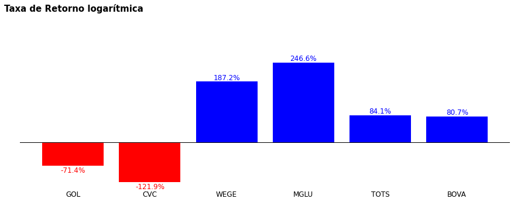
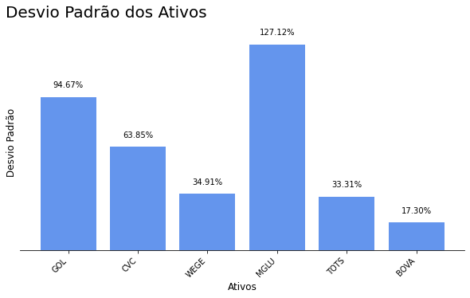
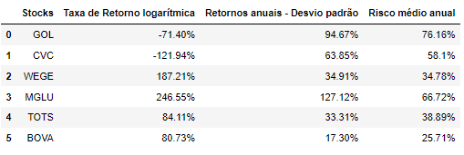

# Cálculo do risco das ações - Finanças parte 2
Este repositório contém script em python para o cálculo de retorno simples e logarítmica e o risco médio anual para todas as ações da carteira

 

# _Objetivo do projeto_

Extrair os preços de ações da internet para observar o comportamento da carteira de ações no período de 2015 até 2022 das empresas:

- GOLL4.SA;
- CVCB3.SA;
- WEGE3.SA;
- MGLU3.SA;
- TOTS3.SA;
- BOVA11.

 

# _1. Problema de Negócio_

O mercado financeiro é um ambiente extremamente complexo e dinâmico, onde investidores buscam constantemente informações e insights para tomarem decisões mais informadas. O comportamento das ações é um dos principais indicadores para investidores avaliarem a saúde de uma empresa, bem como as tendências do mercado como um todo.

E o problema é a dificuldade em compreender o comportamento da carteira de ações ao longo do tempo, o que prejudica a tomada de decisão estratégica em relação aos investimentos.

Fonte: Biblioteca yFinance

 

# _2. Justificativa_

- **Por quê:** A análise do comportamento das ações é essencial para avaliar a saúde das empresas e identificar as tendências do mercado financeiro. Compreender o desempenho da carteira de ações permite aos investidores tomar decisões mais informadas, comparando seu retorno com o desempenho da BOVESPA e outros fundos de investimento.
- **Como:** Utilizando técnicas de ciência de dados, serão coletados os preços diários das ações das empresas incluídas na carteira. Em seguida, serão aplicados métodos de análise, como a taxa de retorno simples e logarítmica, o cálculo dos retornos anuais, a variância, o desvio padrão e o coeficiente de variação. Essas análises fornecerão insights sobre o comportamento da carteira ao longo do tempo e permitirão compará-la com a BOVESPA.
- **O quê:** O projeto envolve a extração e análise dos preços diários das ações da carteira, utilizando métodos de ciência de dados para calcular e comparar os retornos, variância, desvio padrão e coeficiente de variação. Os resultados serão entregues em um relatório detalhado, contendo gráficos e visualizações que auxiliam na compreensão dos insights gerados pela análise. Essa solução possibilitará aos investidores tomar decisões mais informadas e estratégicas em relação à sua carteira de ações.

 

# _3. Premissas_

As variáveis originais do conjuto de dados são: 

Variável | Definição
------------ | -------------
Date | data que teve negociações na bolsa de valores|
Open | valor de abertura|
Close | valor no final do dia|
Low | menor valor que atingiu no dia|
Volume | quantidade de ações negociada no dia|
Adj Close | fechamento ajustado, ou seja indica qual o preço real no final do dia (aqui leva em consideração os dividendos da empresa que pode influênciar no fechamento da ação.)|

Aos feriados e finais de semana a bolsa de valores é fechado e não há negociação nesse dia, então vamos ter datas somente nos dias que teve negociação.

Dividendos é uma fatia dos lucros que as empresas pagam para os acionistas.

**Mas vamos criar um dataframe, somente com a coluna 'Close'.**

 

# _4. Planejamento da Solução_

0. **ENTENDIMENTO DO NEGÓCIO**

Definição do problema: É importante definir claramente qual é o problema a ser resolvido ou a pergunta a ser respondida. É preciso entender o objetivo do projeto e a relevância do problema.

    - Descrição do negócio
    - Planejamento da solução

1. **IMPORTANDO AS BIBLIOTECAS**

Importação de bibliotecas: Nesta etapa, as bibliotecas necessárias para o desenvolvimento do modelo de machine learning são importadas. Isso inclui bibliotecas para manipulação de dados, visualização, modelagem e avaliação.

2. **COLETA DOS DADOS**

Coleta de dados: Nesta etapa, os dados são coletados a partir de diversas fontes, como bases de dados, APIs, arquivos de texto, imagens, etc.

3. **LIMPEZA DOS DADOS**

Limpeza dos dados: Esta etapa consiste na descrição estatística dos dados coletados, como média, mediana, desvio padrão, entre outros. É importante entender os dados coletados, avaliar a qualidade dos dados e identificar quaisquer problemas ou limitações.

    - **1:** Coluna
    - **2:** Dimensões de dados
    - **3:** Tipos de dados
    - **4:** Verificando dados nulos
    - **5:** Estatística descritiva

4. **ANÁLISE EXPLORATÓRIA DOS DADOS**

Análise exploratória de dados: Nesta etapa, os dados são visualizados e analisados graficamente para identificar padrões e relações entre as variáveis.

    - **1:** Cálculo dos retornos anuais - Taxa de Retorno Logarítmica
    - **2:** Cálculo dos retornos anuais - Variância
    - **3:** Cálculo dos retornos anuais - Desvio padrão
    - **4:** Coeficiente de variação
    - **5:** Cálculos com todas as ações - risco médio anual
    - **6:** Conclusão dos cálculos: Taxa de Retorno Logarítmica - Retornos anuais - Risco médio anual
    - **7:** Correlação entre ações
    - **8:** Risco de um portfólio para Gol e CVC
    - **9:** Risco de um portfólio para todas as ações

5. **INSIGHTS**

Nesta etapa, são identificadas as principais descobertas e conclusões do projeto.

6. **PRÓXIMOS PASSOS**

Nesta etapa, são definidos os próximos passos a serem tomados com base nos resultados obtidos e nos insights identificados. Isso pode incluir melhorias no modelo existente, coleta de mais dados, exploração de diferentes modelos, entre outros.

 

# _5. Insights_

*Resumo dos insights durante análise exploratória de dados (EDA):*

**Gráfico - taxa retorno logarítmica ativos.**

 

**Nota:**
- A taxa de retorno logarítmica é uma medida de desempenho que leva em consideração o preço de fechamento da ação e o preço de abertura. Uma taxa de retorno logarítmica positiva indica que o preço da ação aumentou ao longo do ano, enquanto uma taxa de retorno logarítmica negativa indica que o preço da ação diminuiu.
- Podemos ver que a GOL e a CVC tiveram taxas de retorno logarítmica negativas, o que significa que essas ações perderam valor ao longo do ano.
- Já a WEGE e a MGLU tiveram taxas de retorno logarítmica positivas muito elevadas, o que significa que essas ações tiveram um desempenho muito bom no período analisado.
- TOTS e BOVA tiveram taxas de retorno logarítmica positivas, mas mais modestas do que WEGE e MGLU.

**Gráfico - retornos anuais usando o desvio padrão.**

 

**Nota:**
- É errado afirmar que temos uma taxa de retorno somente com o cálculo da variância, porque temos os valores elevados ao quadrado, para isso usamos o desvio padrão para ajudar na interpretação, ou seja, o desvio padrão é a raiz quadrada da variância e mostra a dispersão dos retornos em relação à sua média.
- Quanto maior o desvio padrão, teoricamente mais risco essa ação apresenta, pois ela tem uma variação maior.
- O desvio padrão basicamente é calcular a raiz quadrada da variância.

- Por exemplo:
    - A variância da CVC é de: 4076.38
    - Aplicando o desvio padrão passa a ser: 63.85

Agora podemos afirmar que a variância da taxa de retorno da empresa CVC no período de 2015 até o período de 2022 é de 63.85%.

**Conclusão dos cálculos: Taxa de Retorno Logarítmica - Retornos anuais - Risco médio anual.**

O cálculo dos retornos anuais usando o desvio padrão pode ser útil para avaliar a volatilidade histórica de um ativo e compará-lo com outros ativos, permitindo que os investidores identifiquem ativos mais arriscados ou menos arriscados. Além disso, pode ser uma boa ferramenta para a elaboração de estratégias de diversificação de carteira.

Por outro lado, o cálculo do risco médio anual usando o desvio padrão pode ser mais útil para avaliar o risco futuro esperado de uma carteira de investimentos, com base na volatilidade histórica dos ativos. Isso pode ser especialmente importante para investidores que desejam avaliar o risco de sua carteira em um horizonte de tempo mais longo.

Portanto, a escolha entre os dois métodos dependerá do objetivo da análise e da estratégia de investimento. Em uma reunião de resultados, pode ser útil apresentar ambos os cálculos para fornecer uma visão mais completa da performance da carteira.

 

**Nota:**
- **Taxa de retorno logarítmica:** é uma medida da variação percentual do preço da ação ao longo do tempo. É calculada como o logaritmo da razão entre o preço final e o preço inicial da ação, multiplicado por 100. Essa medida mostra o desempenho geral da ação em termos de variação de preço.
    - Por exemplo, para a ação GOL, a taxa de retorno logarítmica foi de -71,40%, o que indica uma queda significativa no preço da ação ao longo do tempo.

- **Retornos anuais - desvio padrão:** é uma medida de risco que indica o quão volátil é o preço da ação em relação à sua média. É calculada como o desvio padrão dos retornos anuais da ação. Quanto maior for o valor do desvio padrão, mais arriscada é a ação, pois há uma maior variação nos preços ao longo do tempo. Nos permite avaliar o desempenho histórico das ações e comparar o risco de investimento entre elas.
    - Por exemplo, a ação GOL tem um desvio padrão de 94,67%, o que indica que é uma ação muito volátil e arriscada.

- **Risco médio anual:** é uma medida de risco que indica o risco médio associado à ação. É calculada como o desvio padrão dos retornos diários multiplicado pela raiz quadrada do número de dias de negociação em um ano. Quanto maior for o valor do risco médio anual, mais arriscada é a ação. Nos fornece uma estimativa do risco futuro das ações e nos ajuda a decidir quais delas são mais adequadas para nossos objetivos de investimento.
    - Por exemplo, a ação GOL tem um risco médio anual de 76,16%, o que indica que é uma ação muito arriscada.

Em resumo, os resultados indicam que a ação GOL apresenta um desempenho negativo e é muito arriscada, enquanto a ação WEGE apresenta um desempenho positivo e tem um risco menor. É importante lembrar que a interpretação dos resultados deve levar em conta o contexto específico da análise e não deve ser feita de forma isolada.

- Se o objetivo do investidor for maximizar o retorno, a ação MGLU apresentou o maior retorno no período avaliado.
- No entanto, se o objetivo for minimizar o risco, a ação WEGE apresentou o menor risco médio anual.
- Por outro lado, a pior ação seria aquela com o maior risco e menor retorno, que no caso da tabela é a ação CVC.
- No entanto, é importante lembrar que investimentos com maior retorno potencial geralmente estão associados a um maior risco.

 

# _6. Conclusão_

**Risco de um portfólio para todas as ações**

- O risco para investir na BOVA é menor do que investir nessas empresas individualmente.
    - Carteira 1 (Portfólio) = 0.39
    - Carteira 2 (BOVA) = 0.25

 

# _7. Próximos passos_

**Trabalhar com alocação e otimização de portfólios e para isso vamos fazer:**

- Definição de pesos para as ações
- Sharpe ratio (é um dos cálculos mais utilizados para medir o desempenho de uma carteira de ação)
- Cálculo de Markowitz (para medir o desempenho de um portfólio de ações)
- Alocação randômica de pesos
- Algoritmos de otimização (vamos usar esses três algoritmos de inteligência artificial para descobrir quais são os melhores pesos):
    - Hill climb (subida da encosta)
    - Simulated annealing (têmpera simulada)
    - Algoritmo genético
